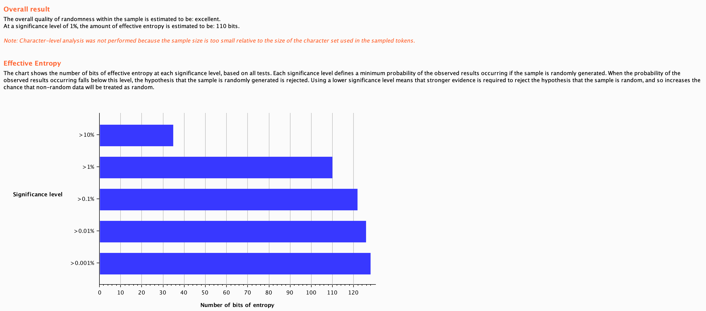

# Etude de menaces préliminaire

Ce rapport contient une liste de menace et de ce qui a été fait pour trouver les failles potentielles de l'application.

Dans un premier temps, nous avons tenté d'accéder à des données de l'application dont on ne devrait pas avoir accès. Ceci sans avoir accès au code source de l'application.

Dans une deuxième temps, nous avons pris le code pour trouver des erreurs dans le code même. Même si nous avons pas exploité certaines fails nous avons cherché des bouts de code qui pourraient être améliorés.

## Application WEB

### Authentification

* échange de Cookie
* Mot de passe et authentification

Nous avons vu que le Cookie et les données d'authentification étaient tranmises en claire. En effet l'application utilise HTTP. Il n'y a donc pas de SSL pour sécuriser les échanges

#### Vole du Cookie


#### Vole de l'username + password


Il serait donc possible de récupérer le Cookie et le rejouer ou simplement avoir les informations d'un utilisateur et se connecter avec son username/password.

#### Destruction du Cookie

Vérification que le bouton ```logout``` détruit correctement le Cookie.


On voit que le Cookie et le Token ne change pas. Mais la session est détruite correctement côté serveur


Essayer de rejouer le cookie dans un autre naviguateur. La session n'est pas accessible

#### Test de la qualité du Cookie

* Regarder si des Cookies se ressemble
* Utilisation de BURP pour tester la solidité du Cookie

#### Cookie ressemblant

Connexion avec 2 utilisateurs depuis la même adresse IP source, au même moment et avec deux noms d'utilisateurs très semblables et le même password.

* User1 = AAA
* User2 = AAB

```PHPSESSID	m10keuffg4u7v2f7uniocoo645```

```PHPSESSID 	u7mltdp4289sfrubqgn4coq2p6```

On voit également que le Cookie est transmis avant la session. Dès l'accès à la page ```login.php``` un cookie est transmis

=> Cookie random aucune ressemblance

#### Qualité des Cookies distribués

Extrait de plus de 1000 Cookies récupérés avec BURP.
L'analyse de ces Cookie est excellente.



#### "Remember password"

Il n'y a pas d'option "Remember password" qui pourrait présenter quelques failes.


#### Récupération du mot de passe

Il n'y a pas d'option pour récupérer son mot de passe ```mot de passe oublie```.
Il n'y a donc pas d'envoie de mot de passe par email ou de questions de sécurité.


### Analyse de la base de données

- Stockage des informations
- Requêtes faites sur la base de données

#### Tentatives d'attaques injection SQL


L'application utilise donc une base de données SQLite.
Quelques failles ont été remarqué en lisant le code.

### Elevation de privilège

* Depuis un utilisateur récupérer les messages d'un autre
* Obtenir la page ```index.php``` d'un autre utilisateur


#### Modification du Cookie


Essayer de modifier des paramètres dans le Cookie. Uniquement le token de session est présent
Si nous avons réussi à voler un Token de Session, nous accédons à la page d'un autre utilisateur.


#### Tentative d'accéder à une page admin

Entrer directement dans l'URL le nom d'une page qui devrait être interdite aux utilisateurs simples.
Exemple : ```accuser.php```


Il y a une redirection qui envoie directement sur la page ```index.php```.


#### Passer des paramètres dans l'URL

En passant la souris sur le bouton "Read" on voit que l'URL est :

* http://127.0.0.1:18080/read.php?id=44


Tentative de passer un autre ```id``` pour lire un autre message.


L'accès est refusé car on n'est pas le destinataire.


### Recherche d'informations supplémentaires

Recherche d'informations supplémentaires

* Créer des erreurs avec les requêtes et les paramètres
* Regarder les commentaires


#### Chercher les commentaires

Analyser le contenu des pages pour voir si certains commentaires ont été laissés. Certains pourrait donner des informations sur l'application


Il n'y a aucune page avec des informations compromettantes.

Pas d'info dans le ```css``` non plus.


#### Création de message d'erreurs

Avec des requêtes SQL contenant des caractères réservés par SQL.
Les erreurs sont traités et les messages affichés sont très simple.


## Code source

L'application contenait certaines erreurs de programmation. Cette partie définit les erreurs trouvées.
Cette partie ne corrige pas uniquement des fails de sécurité. Elle montre les améliorations faites dans le code ainsi que les améliorations logiques faites a l'application.


### Base de données 

Certaines requêtes n'utilisaient pas de ```prepareStatement```. Exemple de code :

```php
// Connect DB
$file_db = new PDO('sqlite:/usr/share/nginx/databases/database.sqlite');
// Set errormode to exceptions
$file_db->setAttribute(PDO::ATTR_ERRMODE, PDO::ERRMODE_EXCEPTION);
// Select all users/password in DB
$file_db->exec("SELECT username FROM users;");
$exist = False;
```


Les mots de passes était stockés en clair dans la base de données

```php
$file_db->exec("INSERT INTO users (username, password, enable, admin) 
					VALUES ('$newusername' , '$password', '$enable' ,'$admin');");
```


Les connexions à la base de données n'était jamais fermées.

=> possibilité de rendre l'application indisponible


Aucun test n'était fait lors de l'insertion ou l'update des valeurs.

=> possibilité de mettre des mauvais types de données.


### PHP

Une erreur, a été faite

```php
<?php
session_start();
if (isset($_SESSION['username'])) {
    header("Location: index.php");
    
// --------------
if (empty($_POST["username"])) {
        $usernameErr = "Username is required";
    } else {
        $username = htmlspecialchars($_POST["username"]);
		$userEmpty = False;
    }
```

Le code suivant cela peut-être lancer.
Le ```if``` ne test pas toutes les possibilités.

