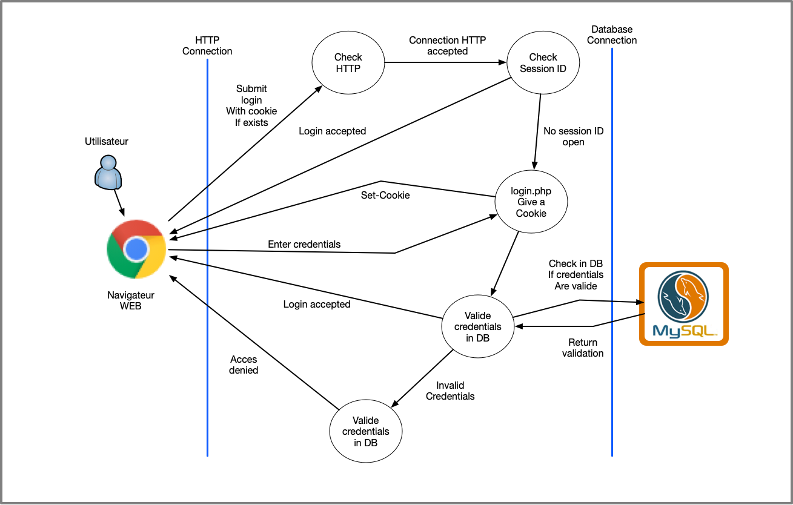
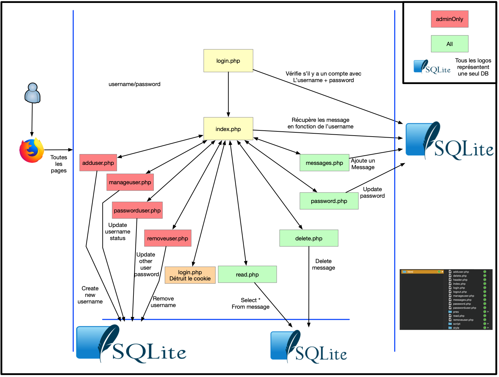
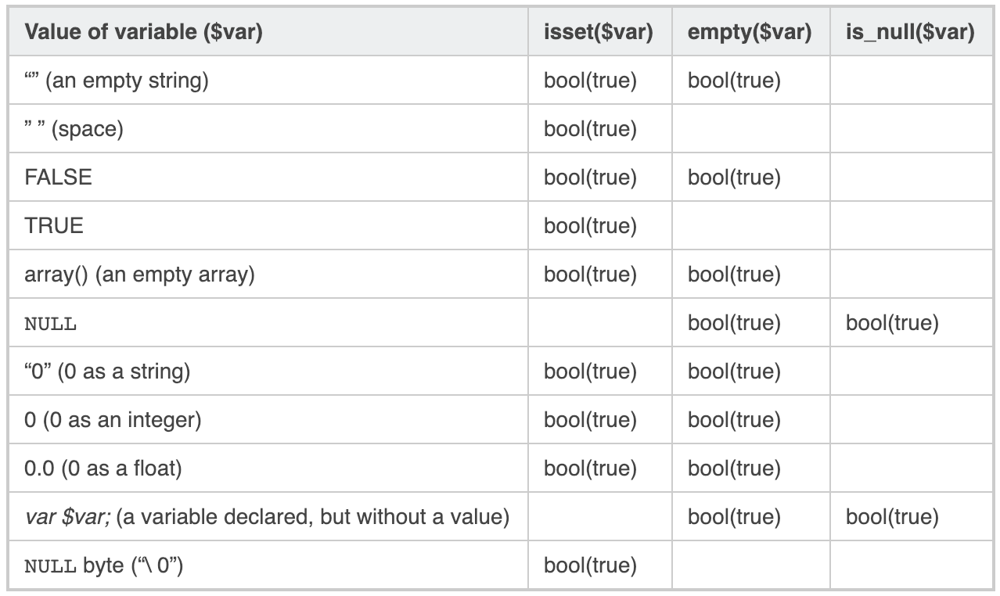

 # STI - Projet No 2

## Introduction 

L'application permet d'envoyer des messages d'un utilisateur à l'autre. Ces messages sont stockés dans une base de données ```SQLite```. 

Pour que l'utilisateur puisse afficher ces messages, l'application utilise une requête SQL pour récupérer tous les messages en fonction du récepteur du message.
=> Si le nom du destinataire est le même que le nom de l'utilisateur connecté, alors le message sera affiché.

L'utilisateur peut supprimer et lire les messages. Il peut également répondre à un message. Dans ce cas, l'ancien message est affiché.

Le but est de sécuriser au maximum cette application en se basant sur les présentations faites par les autres étudiants durant le cours.

* Gestion correcte des sessions.
* Protection contre les injections SQL.
* Accorder les bons droits aux utilisateurs et bloquer l'élévation de privilèges.

## Tables des matières

[TOC]

## Description du système

### Data flow diagram



Ci-dessus, un "data flow diagram" permettant de comprendre le login l'application.
L'utilisateur envoie une requête au serveur WEB via son navigateur WEB.
Le serveur va dans un premier temps vérifier que la requête HTTP est correct.

Si la requête arrive avec un Token de session correspondant à une session active du côté du serveur, le login est accepté et l'utilisateur peut accéder à ses pages.

S'il n'y a pas de sessions, l'utilisateur va être redirigé vers la page ```login.php``` sur laquelle ses credentials lui seront demandées. Dès lors, s'il n'a pas de cookie, un cookie va lui être attribué via un champ ```Set-Cookie```. La session n'est en revanche pas active et liée à un utilisateur côté serveur.

L'utilisateur entre ses credentials dans le formulaire et soumet cela à l'application. Les credentials seront validées au niveau de la base de données.

Si les données sont correctes et lié à un utilisateur, la session sera créée et associée à un Token. L'utilisateur pourra donc, avec son token accéder à toutes les pages.

Le schéma ci-dessous représente les différents échanges entre les pages et la DB.



### Identification des biens

L'application contient une base de données. Le but et de limiter les requêtes à la base de données. Lors d'une requête, il faut récupérer uniquement les informations nécessaires.

Il faut faire une requête uniquement quand c'est nécessaire.

Lors d'```INSERT``` ou un ```UPDATE``` les données doivent être vérifiée.

Le cookie tranmis pour l'identification des utilisateurs doit être unique et non-prédictible.
Utiliser un algorithme suffisant.

Ce cookie doit également être tranmis sur un canal sécurisé.

### Perimètre de sécurisation

La base de données doit être sécurisée.
Elle contient tous les éléments de l'application :

* Messages
* Username + Password

Ces données sont sensibles et doivent être innaccessibles pour une personne non connecté.

## Sources de menaces

Les sources de menaces peuvent être toutes les personne désirant accéder à des messages des utilisateurs. 

Cela peut être un attaquant externe ou simplement un utilisateur qui est connecté et qui essaie d'obtenir des informations qu'il ne devrait pas pouvoir obtenir

Typiquement les messages d'autres utilisateurs qui ne lui sont pas destinés.

## Scénarios d'attaques

### Elements du systèmes attaqué

Plusieurs éléments peuvent être attaqués.

* La base de données. Pour avoir accès directement aux mots de passe et aux données des utilisateurs.
* Les sessions. Permettrait d'utiliser la session d'un utilisateur et donc de voir ses messages.

### Motivation(s)

Pouvoir obtenir des messages privés et confidentiels.

Pour obtenir des mots de passe utilisateur et pouvoir les essayer sur d'autre sites. Souvent les utilisateurs utilisent les mêmes mot de passe pour toutes les sites Web.

Par fierté et challenge personnel de pouvoir hacker une application Web.

Mettre le site Web hors service.

Pouvoir exécuter des scripts depuis ce serveur ou encore utiliser ces ressources pour d'autres activités.

### Scénario(s) d'attaque

#### Collectes d'informations

Dans un premier temps, l'attaquant va essayer d'obtenir des informations par rapport à l'application

* Language de programmation ```PHP```

* Version du language ```PHP 5.5.9```

  ```bash
  root@sti:/# php5-fpm --version
  PHP 5.5.9-1ubuntu4.25 (fpm-fcgi) (built: May 10 2018 14:38:55)
  Copyright (c) 1997-2014 The PHP Group
  Zend Engine v2.5.0, Copyright (c) 1998-2014 Zend Technologies
      with Zend OPcache v7.0.3, Copyright (c) 1999-2014, by Zend Technologies
  ```

* SGBD utilisé ```SQLite```

* Version du SGBD

* OS du serveur

* Architecture de l'application

* Serveur Web : nginx ou Apache

* Version du serveur web

Faire du social enginerring pour avoir plus d'informations sur les utilisateurs et sur la plateforme afin, par exmple, de déduire le mot de passe d'un utilisateur.

### Trouver des failles sur les versions

Une fois que l'architecture et les composants connus, il faut chercher des failles connus sur ces divers versions, OS et architecture.

### Recherche d'informations supplémentaires

Il serait également possible de trouver des informations par rapport à l'application en naviguant dessus. Il faudra regarder attentivement les commentaires qui ont pu être laissés dans les pages HTML / PHP.

Il est également interessé d'inspecter le code en utilisant l'inspecteur des navigateurs.

Essayer de générer des erreurs sur les différentes pages de l'application. Une exception levée ou un message d'erreur peut donner des informations par rapport à la base de données, à l'application ou encore aux données qui sont attendues dans les requêtes.

Comprendre si le token a été créé sur une information connue comme la date/heure, l'adresse IP source ou encore le nom d'utilisateurs. Exemple ci-dessous en Java.

```java
synchronized protected int getSessionID () {
	seed = String sessId = 
        Integer.toString(s_SessionIndex++) + 
        “-” +
        System.currentTimeMillis();
	return (int)(seed >>> (48 - bits));
}
```

```java
synchronized protected int next(int bits) {
	seed = (seed * 0x5DEECE66DL + 0xBL) & ((1L << 48) - 1);
	return (int)(seed >>> (48 - bits));
}
```

### À l'attaque :bomb::hocho:

à cette étape, il faudra essayer de s'introduire dans le système ou l'application 

* Accéder à la base de données 
* Se connecter sur le compte d'un utilisateur en utilisant son cookie
* Trouver une faille PHP
* Procéder à une escalade de privilèges
* Exécuter du code malveillant sur le serveur disant
* Utiliser les ressources
* Récupérer des informations comprométantes et confidentiels.

### Attaquer encore plus

Une fois que l'on a réussi a attaquer le système au travers d'une fail, le but et de pouvoir utiliser cette faille  pour pouvoir accéder à encore plus d'informations mais également faire une escalade de privilège et maintenir un accès à l'instance.

### Laisser une porte

Cela permettra de garder un accès permanant sur l'application ou le système => backdoor

### Supprimer les logs

Dans le but de passer inconnu et que l'attaque ne soit pas identifiée on va chercher à supprimer nos traces après l'intrusion.

### STRIDE

- **S**poofing : usurper l'identité d'un client
- **T**ampering : altération des données à la volée (interception de la requête HTTP POST / GET et modification des données envoyées)
- **R**epudiation : une personne non autorisée ayant réussi à se logguer sur le compte d'un utilisateur pourrait envoyer un mail à son insu.
- **I**nformation disclosure : fuite d'informations sensibles
- **D**enial of service : rendre l'application indisponible
- **E**levation of privilege : une fois un accès utilisateur obtenu on peut par exemple tenter d'obtenir un accès admin.

## Contre-mesures

Mesures prises pour sécuriser l'application

### Base de données

* Utiliser des preparedStatement
* Hasher le mot de passe en DB (avec SEL)
* Vérification des saisies utilisateurs


### Elévation de privilèges

* Améliorer et valider les checks et conditions en fonction des actions voulues
* Limiter le champ d'action des utilisateurs


### Session

* Utiliser un algorithme de création de token de qualité
* Utiliser HTTPS pour échanger les informations telles que le mot de passe et le Cookie
* Utiliser une fonction de destruction de Cookie de qualité
* Mettre un lifetime et un path au Cookie


### PHP

* Augmenter la clareté du code pour faciliter les modifications et éviter les vulnérabilités dû a certaines modifications de code.
* Suppression des commentaires ou messages d'erreurs qui pourraient donner des informations à un attaquant.
* Gestion des erreurs


### Système

* Mise en place d'outils permettant de sécuriser l'application
  * Fail2Ban
  * ModSec
  * Fail2Ban
  * Anti-DDOS
  * Etc.


## Améliorations

### Base de données

Amélioration des échanges avec la base de données

#### Statement

Dans le code PHP, toutes les interactions avec la base de données ont été remplacés par des ```statement```. Les fonctions pour fermer les connexions à la DB proprement ont été ajoutées.

```php
// Select all users/password in DB
$stmt = $file_db->prepare("SELECT username FROM users WHERE username=:username;");
$stmt->bindParam(':username', $username, PDO::PARAM_STR);
$file_db->execute();
$rowCount = $stmt->rowCount();

// Proper DB connection close
$stmt->closeCursor();
$file_db = null;
```

#### Hash du mot de passe

Le mot de passe est maintenant stocké hashé dans la base de données en utilisant la librairie ```sodium```

```php
$password = $_POST["password"];
$hash = \Sodium\crypto_pwhash_str($password,
        \Sodium\CRYPTO_PWHASH_OPSLIMIT_INTERACTIVE,
        \Sodium\CRYPTO_PWHASH_MEMLIMIT_INTERACTIVE);
```

### Elévation de privilèges

Un ```exit``` a été ajouté dans le ```header```

```php
if (!isset($_SESSION['admin']) or $_SESSION['admin'] !== 1) {

    // Make sure you end script execution if not logged in
    exit(header("Location: index.php"));
```

Nous avons également ajouter ```or $_SESSION['admin'] !== 1``` dans le test de base pour accéder à une page. 



<u>Réf</u> : https://www.virendrachandak.com/techtalk/php-isset-vs-empty-vs-is_null/

### Session 

Les token de session sont distribuées avec grâce à ```PHPSESSID```

```php
<?php
session_start();
```

Ces token ont été testé avec BURP et les résultats sont excellents.

### SSL 

L'application utilise maintenant SSL. Cela permet de passer les informations de manière sécurisé.

Token sur un canal sécurisé.

Credentials ne passe plus en clair sur le réseau.

###  Déstruction de Cookie

Destruction du cookie afin d'il soit supprimé du côté serveur

```php
<?php
session_start();
session_unset();
session_destroy();
header("Location: login.php");
?>%
```

### Lifetime sur un Cookie

Un lifetime a été mis sur le cookie

```php
ini_set('session.gc_maxlifetime', 30*60);
```

### Vérification plus poussée des paramètres

Les types de données sont vérifiés avant l'insertion dans la base de données

```php
$stmt = $file_db->prepare("INSERT INTO users (username, password, enable, admin)
					VALUES (:username, :password, :enable, :admin);");
$stmt->bindParam(':username', $username, PDO::PARAM_STR);
$stmt->bindParam(':password', $hash, PDO::PARAM_STR);
$stmt->bindParam(':enable', $enable, PDO::PARAM_INT);
$stmt->bindParam(':admin', $admin, PDO::PARAM_INT);
$file_db->execute();
```

## Conclusion 

La sécurisation d'un site/application WEB demande de mettre en place beaucoup de méchanisme de sécurité. Une petite erreur de configuration peut mettre en péril la sécurité de tout le système.

Il est également important d'utiliser les dernières versions des différents composant.
Mettre à jour l'OS, PHP, le SGBD, et les différentes librairies qui composent l'application, etc.

Utiliser des librairies "à la mode" qui garantissent un bon fonctionnement de l'application et un niveau de sécurité élevé.